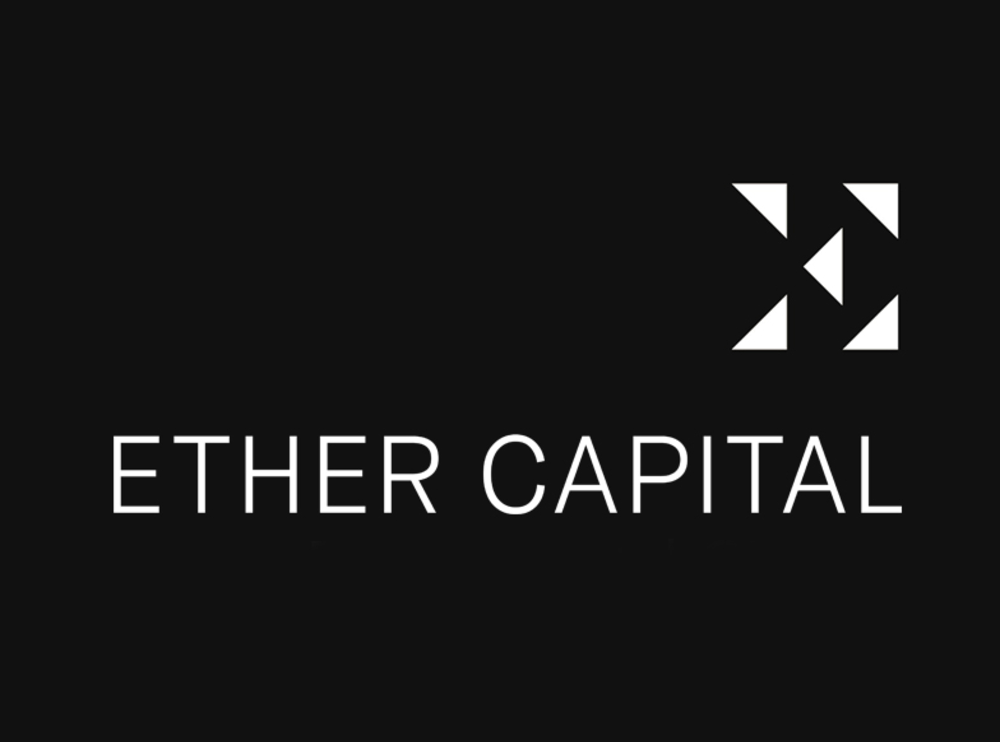

# Staking Engineer (DevOps)

## Job description

Looking for a multiskilled DevOps Engineer to join our team to help configure, maintain and automate our infrastructure for Staking, focused primarily on Ethereum 2.0. We would like to fully develop and automate our staking solution, with proper monitoring and fault tolerance infrastructure to minimize the risks of protocol penalties.

If you are interested in scaling up your career while helping the Ethereum network to scale and transition to Proof of Stake (PoS), this role is for you.

This is a full-time remote-first position, with team members in Toronto and Montreal, Canada.

You will report to the Chief Technology Officer and work closely with the whole team. It is crucial that you are comfortable working in an unstructured environment and self motivated to seek out problems and solutions while multitasking.

### Company mission

[Ether Capital](https://www.ethcap.co/) strives to be the single biggest Ether (ETH) accumulator in the capital markets. We plan to generate an attractive yield off our balance by participating in Ethereum network infrastructure. We intend to use the net proceeds to develop unique IP for the crypto ecosystem and traditional finance.

Ether Capital is a publicly traded company based in Toronto, listed on the NEO Exchange under the ticker "[ETHC](https://www.neo.inc/en/live/security-activity/ETHC)".

## Responsibilities

-   Manage and monitor cloud infrastructure & Linux server administration (AWS, Docker)
-   Deployment automation and documentation
-   Design and implement low-latency, high-availability staking infrastructure
-   R&D on the recent alpha releases (PoS, Beacon chain merge and post-merge tooling)
-   Collaborate on technical content pieces and explainers on the subject of staking
-   Own functionality and scalability features by taking responsibility from inception to deployment

## Qualifications

-   1+ years of experience in blockchain ecosystem 
-   Develop a deep understanding and expertise on the technical level of the ETH2 protocol (such as validation, slashing, network edge cases).
-   Maintain awareness of the current and upcoming protocol and client upgrades, EIPs, and post-merge changes
-   Experience working in high uptime 24/7 environments 
-   Knowledge of Linux and Docker deployment, configuration and resource monitoring/identifying bottlenecks (Kubernetes)
-   Significant experience with 1+ system administration scripting languages (Python, Shell script)
-   Experience with Node.JS/Typescript and RESTful API design
-   Strong understanding of security best practices
-   Open Source and Crypto hacker (Git, Version control, cryptography fundamentals, etc)
-   Familiarity with decentralized finance (DeFi) products 
-   (Bonus) Experience with Golang, and Kafka

## Requirements

-   Excellent communication skills in English
-   Significant experience with Docker and Kubernetes
-   Experience with running different Ethereum nodes (Geth, OpenEthereum, Erigon, etc)
-   Experience with running ETH2.0 validator and beacon chain nodes (Lighthouse, Prysm, Teku, etc)
-   (Bonus) Lido or RocketPool node operator
-   (Bonus) Code contributor of any ETH2.0 software stack
-   (Bonus) Finished Ethereum 2.0: Serenity [Study Master](https://ethereumstudymaster.com/courses/ethereum-2-0-studymaster-program)
-   Strong passion for Ethereum and blockchain technology

## Compensation

-   Salary: $100.69K+ 
-   Stock options and bonus
-   Working for a publicly traded company (ETHC, known for helping launch the world's first Bitcoin and Ethereum ETFs)
-   Remote first team (Canadian residence preferred), task-based with flexible hours
-   One of the first 10 employees

## How to apply
Please send an email to `jobs@ethcap.co` and include:

- CV / Resume / Website
- Socials (Twitter, Linkedin, Github, etc)
- A paragraph on why this position and why you (a.k.a cover letter)

